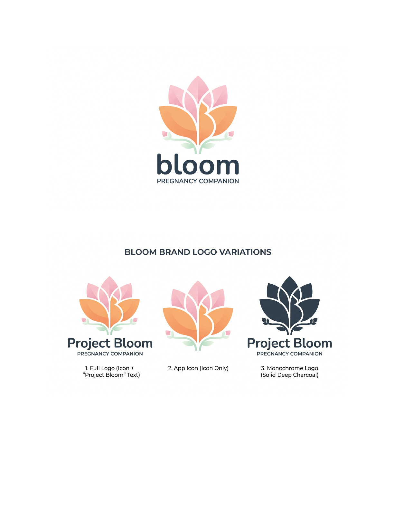

# Project Bloom — Master Brand Kit

> **App Concept:** A modern, lightweight, and culturally resonant pregnancy companion app for women in India.
>
> **Brand Vibe:** Reassuring, modern, maternal, and culturally rooted — without being traditional or heavy.

---

## Table of Contents

1. [Brand Foundation & Story](#1-brand-foundation--story)
2. [Visual Identity & Rules](#2-visual-identity--rules)
3. [Digital & Product Design (UI)](#3-digital--product-design-ui)
4. [Voice, Content & Grammar](#4-voice-content--grammar)
5. [Everyday Business & Social](#5-everyday-business--social)
6. [Sonic & Legal](#6-sonic--legal)
7. [Logo Reference Sheet](#7-logo-reference-sheet)
8. [Quick-Reference Cheat Sheet](#8-quick-reference-cheat-sheet)
9. [Content Requirements & AI Generation Prompts](#9-content-requirements--ai-generation-prompts)

---

## 1. Brand Foundation & Story

| | |
|---|---|
| **Mission** | To empower expectant mothers in India with modern medical insights wrapped in the comfort of cultural wisdom. |
| **Vision** | A healthy, joyful, and anxiety-free pregnancy journey for every Indian mother. |
| **Brand Archetype** | **The Caregiver** meets **The Sage** — empathetic, nurturing, knowledgeable, and deeply trusted. |
| **Tagline** | *"Your modern companion for a mindful pregnancy."* |

### Elevator Pitch (50 words)

> Project Bloom is a digital pregnancy companion designed specifically for the modern Indian woman. By blending evidence-based health tracking with comforting cultural wisdom — from dietary tips to *Garbh Sanskar* (mindful pregnancy) concepts — Bloom provides a light, reassuring, and intuitive space for mothers to navigate their journey with confidence.

---

## 2. Visual Identity & Rules

### 2.1 The Logo System

The primary logo is a soft, minimalist lotus flower whose lower petals subtly form the curve of a pregnant belly. The mark balances **Lotus Pink** (upper petals) with **Soft Saffron** (lower petals) and a small **Tulsi Mint** leaf accent.

See the [Logo Reference Sheet](#7-logo-reference-sheet) for all approved variations.

**Logo Variations**

| # | Variation | Usage |
|---|---|---|
| 1 | **Full Logo** (Icon + "Project Bloom" text) | Primary usage — marketing, website header, splash screens |
| 2 | **App Icon** (lotus/belly mark only) | Mobile app icon, favicon, social avatar, tight spaces |
| 3 | **Monochrome** (solid Deep Charcoal) | Print, fax, single-color backgrounds, embossing |

**Logo Rules — The "Do Nots"**

- **Clear space:** Maintain padding around the logo equal to the width of the letter **"o"** in *Bloom*.
- **Do not** stretch, squash, skew, or rotate the logo.
- **Do not** place the colored logo on busy photographic backgrounds.
- **Do not** recolor the logo outside the official palette.
- **Do not** add drop shadows, glows, or outlines to the mark.

---

### 2.2 Color Palette (Light & Indian Cultural)

We deliberately avoid heavy, saturated traditional colors (bright red, dark green) in favor of a modern, airy pastel take on Indian elements.

| Role | Name | HEX | RGB | Meaning |
|---|---|---|---|---|
| **Primary 1** | Lotus Pink | `#F9C7D2` | `249, 199, 210` | Maternal love, softness, care |
| **Primary 2** | Soft Saffron | `#F4A261` | `244, 162, 97` | Morning energy, auspiciousness, warmth |
| **Secondary** | Tulsi Mint | `#E9F5E9` | `233, 245, 233` | Health, growth, natural soothing |
| **Background** | Sandalwood Neutral | `#FDFBF7` | `253, 251, 247` | Warm off-white — easier on the eyes than pure `#FFFFFF` |
| **Text / Ink** | Deep Charcoal | `#2C3E50` | `44, 62, 80` | Softer and more elegant than pure `#000000` |

**Swatch preview**

```
■ Lotus Pink         #F9C7D2
■ Soft Saffron       #F4A261
■ Tulsi Mint         #E9F5E9
■ Sandalwood Neutral #FDFBF7
■ Deep Charcoal      #2C3E50
```

**Critical rules**

- **Never** use pure black `#000000` for text — it causes eye strain. Always use Deep Charcoal.
- **Never** use pure white `#FFFFFF` as the primary background — use Sandalwood Neutral.
- Deep Charcoal on Sandalwood Neutral passes **WCAG AAA** contrast requirements.

---

### 2.3 Typography

| Role | Font | Style | Why |
|---|---|---|---|
| **Headings** | Playfair Display | Serif | Editorial elegance, trustworthiness, slight heritage feel |
| **Body & UI** | Nunito *or* Inter | Sans-Serif | Highly legible, rounded, soft, friendly — ideal for health apps where readability is paramount |

**Type-setting rules**

- Headings in Playfair Display, **sentence case** (never ALL CAPS or Title Case for long headers).
- Body copy in Nunito/Inter at a comfortable size — minimum 14px, preferred 16px for reading content.
- Line-height generous (1.5–1.6) for calming, breathable layouts.

---

### 2.4 Photography & Illustration Style

**Photography Vibe**

Joyful, light-filled, natural. Women in comfortable modern ethnic wear — soft cotton kurtas, light sarees. **No clinical, sterile, or hospital imagery.** Warm morning lighting, soft focus, conveying comfort, health, and peace.

**Illustration Style**

- Flat, vector-based, featuring soft curves.
- No sharp corners or harsh geometry.
- Rounded, friendly characters and objects.

**Brand Patterns**

- Minimalist, transparent line-art inspired by **Mehndi (Henna)** or **Rangoli** geometry.
- Used **only** as very subtle watermarks in the background of cards — never as a dominant element.

---

## 3. Digital & Product Design (UI)

### 3.1 Design Tokens (CSS Variables)

```css
:root {
  /* Colors */
  --color-lotus-pink: #F9C7D2;
  --color-soft-saffron: #F4A261;
  --color-tulsi-mint: #E9F5E9;
  --color-sandalwood: #FDFBF7;
  --color-deep-charcoal: #2C3E50;

  /* Shape */
  --radius-soft: 16px;          /* Everything rounded and safe — no sharp corners */

  /* Elevation */
  --shadow-float: 0px 8px 24px rgba(244, 162, 97, 0.1); /* Soft, warm — never harsh black */

  /* Typography */
  --font-heading: 'Playfair Display', serif;
  --font-body: 'Nunito', 'Inter', sans-serif;
}
```

### 3.2 Component Specs

- **Buttons:** pill-shaped (fully rounded).
- **Cards & modals:** `--radius-soft` (16px) on all corners.
- **Shadows:** only `--shadow-float` — never harsh `rgba(0,0,0,...)` drop shadows.

**Action color mapping**

| Action Type | Color | Examples |
|---|---|---|
| **Primary** (utility) | Soft Saffron `#F4A261` | Next, Save, Continue, Log |
| **Emotional** | Lotus Pink `#F9C7D2` | Journal, Memories, Favourites, Love entries |
| **Growth / success** | Tulsi Mint `#E9F5E9` | Healthy-state chips, progress complete |

### 3.3 Accessibility (A11y)

- **Sandalwood Neutral must always be the background** for deep reading (articles, tips) to prevent screen glare for sensitive, tired eyes.
- Deep Charcoal (`#2C3E50`) on Sandalwood Neutral (`#FDFBF7`) meets **WCAG AAA** contrast.
- Tap targets: minimum 44×44 px.
- Respect system font-size and reduced-motion preferences.

---

## 4. Voice, Content & Grammar

### 4.1 The Tone Spectrum

| We lean toward… | …over |
|---|---|
| **Empathetic** — guiding like a wise older sister | Authoritative / clinical |
| **Modern** — backing tradition with nutritional science | Purely traditional / folkloric |
| **Calm** — soothing, paced, grounded | Urgent / alarming |

### 4.2 Error Message Style

| ❌ Avoid | ✅ Use |
|---|---|
| "ERROR: Invalid date entered." | "Oops! Let's check that date again so we can track your journey perfectly." |
| "Submission failed." | "Hmm, that didn't go through. Let's try once more." |
| "Required field." | "We'll need this to continue — please fill it in." |

### 4.3 Grammar & Mechanics

- **Sentence case** for all headers (e.g., "Your daily health tips" — *not* "Your Daily Health Tips").
- Contractions are welcome (we're, let's, you'll) — they feel conversational and warm.
- **Emoji use is sparing** — focus on soft, on-brand ones only:
  - 🌸 (bloom, welcome)
  - ✨ (celebration, small wins)
  - 🤍 (care, empathy)
  - 🌿 (wellness, natural)

  Do **not** use loud or clinical emojis (🚨, ⚠️, ❗, 💊).

---

## 5. Everyday Business & Social

### 5.1 Social Media Templates

| Format | Background | Font / Content |
|---|---|---|
| **A — Educational** | Tulsi Mint `#E9F5E9` | Playfair Display quote about the baby's weekly growth |
| **B — Cultural** | Lotus Pink `#F9C7D2` | Tips on navigating Indian festivals while pregnant (e.g., "Fasting tips for Karwa Chauth") |

### 5.2 OG Image (Link Preview)

- **Dimensions:** 1200 × 630 px
- **Background:** Sandalwood Neutral `#FDFBF7`
- **Centerpiece:** Soft Lotus logo
- **Below logo:** Tagline in Deep Charcoal `#2C3E50`

### 5.3 Presentations (Pitch Decks)

- Clean, spacious slides with generous whitespace.
- Subtle line-art mandala pattern as a footer graphic.
- Headings in Playfair Display, body in Nunito/Inter.

---

## 6. Sonic & Legal

### 6.1 Sonic Branding (App Sounds)

| Event | Sound |
|---|---|
| **Success state** (e.g., logging water) | A soft, resonant chime — like a small brass Indian bell, modernized and muted |
| **Notifications** | A gentle acoustic string pluck — reminiscent of a soft sitar or guitar note |

### 6.2 Legal & Disclaimers

Always include the standard medical disclaimer in the app footer and inside all medical articles:

> *"Project Bloom provides general guidance and cultural wisdom. Always consult your gynecologist or healthcare provider for medical advice."*

---

## 7. Logo Reference Sheet

Below is the official brand logo sheet showing the primary logo and all approved variations.



### Individual variations

| # | Variation | Description |
|---|---|---|
| 1 | **Full Logo** (Icon + "Project Bloom" text) | Lotus mark with pink + saffron petals, Tulsi Mint leaf, "Project Bloom" wordmark, "PREGNANCY COMPANION" subtitle in Deep Charcoal |
| 2 | **App Icon** (Icon only) | The pink + saffron lotus mark with mint leaf — used as app icon, favicon, and avatar |
| 3 | **Monochrome Logo** | Solid Deep Charcoal `#2C3E50` — for print, single-color use, and embossing |

---

## 8. Quick-Reference Cheat Sheet

**Colors at a glance**

```
Lotus Pink          #F9C7D2   Primary 1  — maternal, emotional actions
Soft Saffron        #F4A261   Primary 2  — warmth, primary CTAs
Tulsi Mint          #E9F5E9   Secondary  — health, success states
Sandalwood Neutral  #FDFBF7   Background — always, never pure white
Deep Charcoal       #2C3E50   Text       — always, never pure black
```

**Core design tokens**

```
Radius        16px
Shadow        0px 8px 24px rgba(244, 162, 97, 0.1)
Heading font  Playfair Display
Body font     Nunito / Inter
Button shape  Pill (fully rounded)
```

**Voice in one line**

> Empathetic older sister > strict doctor. Modern > traditional. Calm > urgent.

**Approved emoji set**

> 🌸 ✨ 🤍 🌿

---

## 9. Content Requirements & AI Generation Prompts

This section lists every piece of marketing and social content I need for Project Bloom, along with paired prompts for **Gemini Nano Banana** (image/visual generation) and **Claude Design** (layout, copy, and structured design specs).

### 9.1 Reusable Brand Context Block

Prepend this block to every prompt so the AI stays on-brand:

> **Brand:** Project Bloom — a modern, culturally rooted pregnancy companion app for Indian women. **Palette:** Lotus Pink `#F9C7D2`, Soft Saffron `#F4A261`, Tulsi Mint `#E9F5E9`, Sandalwood Neutral background `#FDFBF7`, Deep Charcoal text `#2C3E50`. **Fonts:** Playfair Display (headings, sentence case), Nunito/Inter (body). **Vibe:** empathetic, calm, modern, maternal, airy. **Never:** pure black, pure white, clinical imagery, loud emojis, harsh shadows, sharp corners. **Always:** soft rounded corners (16px), warm lighting, generous whitespace, subtle Mehndi/Rangoli line-art watermarks.

### 9.2 Content Matrix

| # | Content Type | Purpose | Dimensions | Gemini Nano Banana Prompt (Visual) | Claude Design Prompt (Layout + Copy) |
|---|---|---|---|---|---|
| **A. Instagram** | | | | | |
| 1 | **IG Feed Post — Educational** | Share weekly baby growth facts, nutrition tips, myth-busters | 1080 × 1080 px | "Minimalist square social post on a Tulsi Mint `#E9F5E9` background. Soft watercolor illustration of a lotus flower on the left, with generous whitespace on the right for text. Warm morning light, flat vector style, no sharp edges, subtle Mehndi line-art watermark in the corner. On-brand for Project Bloom (pregnancy companion)." | "Design a 1080×1080 Instagram educational post for Project Bloom. Headline in Playfair Display, sentence case, max 8 words. Supporting body line in Nunito, max 15 words. Include a Bloom lotus logo bottom-right. Topic: [WEEK X baby growth fact]. Use Tulsi Mint background, Deep Charcoal text. Output: Figma-ready spec with typography sizes, spacing, and final copy." |
| 2 | **IG Feed Post — Cultural** | Navigate Indian festivals, customs, and traditions during pregnancy | 1080 × 1080 px | "Soft Lotus Pink `#F9C7D2` background, top-down flatlay of a small brass diya, marigold petals, and a sprig of tulsi arranged with airy negative space. Warm morning light, modern editorial styling. Flat yet tactile. No people. On-brand for Project Bloom." | "Design a 1080×1080 cultural tips post. Headline (Playfair Display, sentence case) + 3 short tip bullets (Nunito). Topic: [e.g., Fasting tips for Karwa Chauth during pregnancy]. Lotus Pink background, Deep Charcoal text, subtle saffron accent underline for the headline. Include disclaimer line: 'Always consult your doctor.' Output: copy + layout grid." |
| 3 | **IG Carousel (5–10 slides)** | Deep-dive guides — trimester checklists, Garbh Sanskar basics | 1080 × 1350 px (portrait) | "Series of 5 portrait social slides on Sandalwood Neutral `#FDFBF7` backgrounds. Each slide features one soft, flat vector illustration (lotus, tulsi leaf, pregnant silhouette in modern kurta, bowl of ghee, sleeping moon). Consistent warm palette — Lotus Pink, Soft Saffron, Tulsi Mint accents. Rounded corners, airy layout." | "Write a 7-slide IG carousel for Project Bloom. Topic: [e.g., First trimester self-care]. Slide 1 = hook cover, Slides 2–6 = one insight each, Slide 7 = CTA to download app. Playfair Display headlines, Nunito body. Provide copy + slide-by-slide visual direction + swipe-arrow placement." |
| 4 | **IG Story — Tip of the Day** | Daily bite-sized engagement, polls, quick tips | 1080 × 1920 px | "Vertical story background in Sandalwood Neutral with a soft radial gradient of Lotus Pink in the top-third. Empty safe-zone center-frame for overlay text. Subtle lotus line-art watermark bottom-center. Warm, airy, editorial." | "Design an IG Story layout for Project Bloom. Zones: top 15% for a Playfair Display question (e.g., 'Craving something sour today?'), middle for an interactive poll sticker, bottom 15% for 'Swipe up' CTA in Nunito. Provide exact pixel safe-zones and copy for 5 story variants." |
| 5 | **IG Story — Countdown / Milestone** | Weekly milestones, baby-size comparisons | 1080 × 1920 px | "Vertical story, Tulsi Mint background top-half and Sandalwood Neutral bottom-half with soft watercolor transition. Centered illustration of a fruit/vegetable (e.g., a pomegranate) in soft flat vector style to represent baby size. Warm lighting, rounded, modern." | "Design a weekly milestone story. 'You're in Week [X]!' headline in Playfair Display, baby-size comparison in Nunito, one-line culturally resonant fact (e.g., 'In Ayurveda, this is when…'). Include countdown-to-due-date sticker zone. Output: copy + sticker positions for 40 weekly variants." |
| 6 | **IG Reel Cover** | Consistent grid aesthetic for Reels | 1080 × 1920 px (crop-safe 1080×1350 center) | "Vertical Reel cover, Sandalwood Neutral background, centered editorial title block with a single soft Lotus Pink brush stroke behind the title. One tiny tulsi leaf icon in the top-right. Clean, editorial magazine feel." | "Design a Reel cover template system for Project Bloom. Provide 3 title-layout variants (center, left-aligned, bottom-third). Playfair Display title max 5 words. Include grid-preview crop (1080×1350 center-safe). Output: Figma auto-layout spec." |
| 7 | **IG Highlight Covers** | Organize profile highlights (Tips, Culture, Nutrition, Journal, FAQ) | 1080 × 1920 px (crop to circle) | "Set of 5 minimalist circular icons on Lotus Pink `#F9C7D2` background. Flat vector line icons in Deep Charcoal: lotus, diya, bowl, open journal, question mark. Consistent 2px stroke, rounded terminals. Airy center composition." | "Design 5 Instagram highlight covers (circular crop). Each with a single line-icon centered. Provide icon list, stroke weights, and export specs. Labels: Tips, Culture, Nutrition, Journal, FAQ." |
| **B. Marketing & Ads** | | | | | |
| 8 | **Meta Ad — Square** | Paid user acquisition on Instagram/Facebook feed | 1080 × 1080 px | "Lifestyle photo: an Indian woman in a soft cotton pastel kurta in her second trimester, sitting by a sunlit window with a cup of tea, journaling. Warm morning light, soft focus, joyful and calm mood. No clinical elements. Editorial, on-brand for Project Bloom." | "Write 3 Meta ad variants for Project Bloom. Hook (max 6 words, Playfair Display), body (max 20 words, Nunito), CTA button ('Download free'). Primary offer: 'A pregnancy companion that gets Indian moms.' Provide headline, primary text, description, and button copy for each." |
| 9 | **Meta Ad — Vertical (Stories/Reels)** | Story + Reel placements | 1080 × 1920 px | "Vertical lifestyle shot of a modern Indian mother-to-be holding her belly, bathed in golden-hour light, soft pastels, modern ethnic outfit. Space at top and bottom for ad copy overlay. Warm, aspirational, calm." | "Design a vertical Meta ad with safe-zones for IG UI. Top 15% and bottom 20% reserved. Middle: hook in Playfair Display, supporting line in Nunito. Provide 3 copy variants and layout guide." |
| 10 | **Google Display Ads** | Retargeting + awareness on the web | 300×250, 728×90, 160×600, 320×50 | "Clean display ad backgrounds in Sandalwood Neutral with a small Lotus logo anchor and generous whitespace. Soft Saffron CTA button area. Consistent across 4 sizes." | "Design a responsive display ad system for Project Bloom in 4 IAB sizes. Each with logo lockup, one headline, one CTA. Provide Figma spec + copy: headline ≤5 words, CTA 'Start free'." |
| 11 | **Landing Page Hero Banner** | Website/PWA hero | 1920 × 1080 px | "Wide editorial hero image: an Indian woman in soft morning light, modern pastel kurta, gently holding her belly, sitting in a bright, minimal home with potted tulsi nearby. Shot with shallow depth of field, warm tones, left side of frame open for text overlay." | "Design the landing page hero for projectbloom.app. H1 in Playfair Display (tagline: 'Your modern companion for a mindful pregnancy.'), subhead in Nunito, two CTA buttons (Soft Saffron primary, Lotus Pink secondary). Provide full hero section spec + responsive breakpoints." |
| 12 | **Email Newsletter Header** | Weekly pregnancy insights email | 600 × 200 px | "Email header banner: Sandalwood Neutral background with subtle Mehndi line-art watermark on the right third. Centered Lotus logo with the tagline underneath in Deep Charcoal. Airy, warm." | "Design a responsive email header template for Project Bloom's weekly newsletter. Include: logo lockup, week-number pill ('Week 24'), short greeting ('Good morning, [Name] 🌸'). Provide HTML-safe spec + copy." |
| 13 | **WhatsApp Status / Broadcast Creative** | Community engagement in India's dominant channel | 1080 × 1920 px | "Vertical soft pastel background, Lotus Pink to Sandalwood gradient, centered short inspirational quote area, small lotus icon top-center. Feels personal, shareable, not corporate." | "Design 7 WhatsApp Status creatives (one per day). Each a short mantra or tip (max 10 words) in Playfair Display. Provide weekly copy calendar + layout." |
| 14 | **Blog / Article Header** | In-app and web article covers | 1600 × 900 px | "Editorial article cover, Sandalwood Neutral background, one large flat-vector illustration (varies by topic: tulsi, diya, mother silhouette, fruit), headline space on the left, subtle line-art border." | "Design a blog header template with dynamic headline zone (Playfair Display, max 2 lines), byline (Nunito), read-time pill. Provide 3 illustration-style variants and responsive crops (desktop, tablet, mobile)." |
| **C. App Store & Product** | | | | | |
| 15 | **App Store / Play Store Screenshots** | Conversion on store listings | 1284 × 2778 px (iOS 6.7") / 1080 × 1920 (Android) | "Mockup of a phone on a soft Lotus Pink surface with scattered tulsi leaves and a small brass diya in the corner. Warm morning light, top-down 3/4 angle, editorial product photography feel. Phone screen area left empty for UI composite." | "Design 6 app store screenshots for Project Bloom. Each: phone mockup + headline (Playfair Display, max 6 words) describing one feature (Journal, Weekly tips, Cultural guidance, Doctor-backed content, Reminders, Community). Provide order, copy, and background color per screen." |
| 16 | **App Icon — Store Export** | Final icon for submission | 1024 × 1024 px | "Refined Lotus mark with pink upper petals, saffron lower petals forming a gentle belly curve, and a small Tulsi Mint leaf accent. Centered on Sandalwood Neutral background. Crisp, no shadow, print-ready." | "Produce a 1024×1024 app icon export checklist for Project Bloom: safe-zone, corner-radius behavior on iOS vs Android, contrast verification on light and dark home screens." |
| 17 | **Splash Screen Asset** | In-app launch screen | 1170 × 2532 px (iOS) + Android variants | "Minimal splash: Sandalwood Neutral background with the Lotus mark centered, subtle radial glow of Lotus Pink behind it. Very calm, quiet, almost meditative." | "Design the Project Bloom splash screen. Logo centered at 38% of screen width, tagline ('Your modern companion for a mindful pregnancy.') at 70% vertical, fade-in timing 300ms, min display 2.5s. Provide iOS + Android specs." |
| **D. Launch & Event** | | | | | |
| 18 | **Launch Announcement Post** | Day-one public launch | 1080 × 1080 px + 1080 × 1920 px variants | "Celebratory but calm post: Lotus Pink soft confetti of petals falling on a Sandalwood background, centered empty space for 'We're live' title. Warm, editorial, not loud." | "Write a launch announcement copy set for Project Bloom. Feed caption (max 150 words, warm + confident), Story copy (max 12 words), LinkedIn post (professional, 120 words). Include CTA: 'Download free on iOS & Android.'" |
| 19 | **Testimonial / User Story Card** | Social proof from real moms | 1080 × 1350 px | "Soft pastel card background in Lotus Pink gradient to Sandalwood. Rounded quote mark illustration top-left in Soft Saffron. Centered empty space for quote text. Warm, personal feel." | "Design a testimonial card template. Quote (Playfair Display italic, max 25 words), attribution (Nunito — 'Priya, 28, Bengaluru'), small Bloom logo. Provide 5 sample quote layouts." |
| 20 | **Partner / Doctor Feature Card** | Credibility — OB-GYNs, nutritionists | 1080 × 1080 px | "Circular portrait frame on a Tulsi Mint background, subtle line-art mandala behind. Clean, editorial, trustworthy without being clinical." | "Design a 'Featured Expert' card for Project Bloom. Includes circular portrait, name (Playfair Display), credentials (Nunito), one-line insight they contribute. Provide spec + copy for 3 sample experts." |

### 9.3 Content Cadence (Starting Point)

| Channel | Frequency | Content Mix |
|---|---|---|
| **Instagram Feed** | 4× / week | 2 educational, 1 cultural, 1 testimonial/UGC |
| **Instagram Stories** | Daily | Tips, polls, weekly milestones, behind-the-scenes |
| **Instagram Reels** | 2× / week | Baby-size weekly, myth-busters, founder voice |
| **WhatsApp Broadcast** | 2× / week | Tip + community question |
| **Email Newsletter** | Weekly (Sunday morning) | Weekly letter from Bloom |
| **Blog / Articles** | 1× / week | Long-form SEO cornerstone content |

### 9.4 Prompt Usage Notes

- **Always** prepend the [Reusable Brand Context Block](#91-reusable-brand-context-block) to every generation.
- For Gemini Nano Banana: iterate with "more airy", "softer lighting", "less saturated" if output feels too loud.
- For Claude Design: always ask for a Figma-ready spec (typography sizes, spacing tokens, export dimensions) alongside the copy.
- Reject any output that includes: pure white/black, clinical/hospital imagery, stock-photo-feeling people, harsh shadows, sharp corners, or loud emojis (🚨 ⚠️ ❗ 💊).
