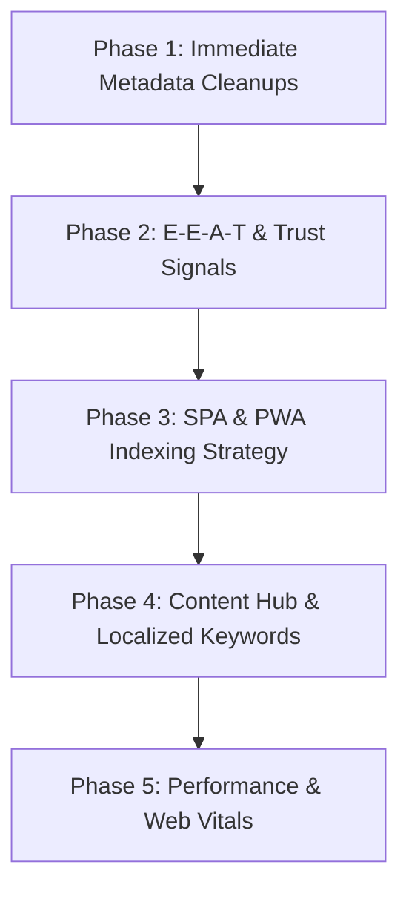

# 🌸 Our Pregnancy (Bloom) — SEO Enhancement Roadmap

This document outlines a structured, phased roadmap to optimize search engine visibility, indexability, and user acquisition for **Our Pregnancy** (`ourpregnancy.in`). 

Pregnancy tracking resides in a highly competitive and strictly regulated **YMYL (Your Money Your Life)** search category. To succeed, our site must demonstrate high technical performance, clear semantic structure, and exceptional compliance with Google's **E-E-A-T** (Experience, Expertise, Authoritativeness, Trustworthiness) guidelines.

---

## 🎯 Executive Summary & Core Challenges

**Our Pregnancy** is built as a Single Page Application (SPA) with Progressive Web App (PWA) capabilities, using **React 19**, **Vite 6**, and **Tailwind CSS 4**. It runs on **Firebase Hosting**.

### The SEO Challenges:
1. **Hash-Based Routing (`#dashboard`, `#setup`, `#privacy`, `#terms`)**: Search engine crawlers (except Googlebot to a limited extent) do not index URL fragments after the hash `#`. Currently, search engines view our entire website as a single, static page (`/`).
2. **Private Client-Side Data (IndexedDB)**: Core tracking utilities are client-side and require authentication or onboarding. They cannot (and should not) be indexed, meaning our search footprint relies entirely on static marketing, informational, and educational pages.
3. **YMYL & E-E-A-T Standards**: Google heavily demotes health-related websites that do not have medically reviewed content, clear author/expert citations, and robust privacy disclosures. It is extremely important to have a clear disclosure and medical review board in place to build trust. We have a Medical Review Board with experienced obstetricians and gynecologists who review our content.

---

## 🗺️ The SEO Roadmap



---

## 📋 Phase 1: Critical Technical Fixes (Immediate)

We have identified several immediate issues in the codebase that can be fixed directly to clean up search indexing and improve social sharing visibility.

### 1.1 Clean Up Duplicate Metadata in `index.html`
In [index.html](file:///Users/lakshaytrehan/Project_Bloom/index.html), there are currently duplicate `<title>`, `<meta name="title">`, and `<meta name="description">` tags (Lines 8-10 conflict with Lines 11-13). This causes search crawlers to pick arbitrary descriptions and titles.

*   **Action**: Consolidate into a single, high-performing title and description.
*   **Target Code Change**:
    ```diff
    -    <!-- Primary Meta Tags -->
    -    <title>Our Pregnancy — Your Free Pregnancy Companion</title>
    -    <meta name="title" content="Our Pregnancy — Your Free Pregnancy Companion" />
    -    <meta name="description" content="A beautifully designed pregnancy companion — track milestones, health vitals, tasks, and decisions, securely synced across your devices." />
    -    <title>Our Pregnancy — Your Secure & Private Pregnancy Companion</title>
    -    <meta name="title" content="Our Pregnancy — Your Secure & Private Pregnancy Companion" />
    -    <meta name="description" content="A privacy-first, beautifully designed pregnancy companion. Track vitals, symptoms, hydration, count kicks, time contractions, and prepare for birth with confidence." />
    +    <!-- Primary Meta Tags -->
    +    <title>Our Pregnancy — Secure & Private Indian Pregnancy Companion</title>
    +    <meta name="title" content="Our Pregnancy — Secure & Private Indian Pregnancy Companion" />
    +    <meta name="description" content="A privacy-first, free pregnancy companion tailored for Indian mothers. Track milestones, blood pressure, kick counts, contraction timing, and scan food safety offline." />
    ```

### 1.2 Fix Image `alt` Text on Landing Page
Ensure search crawlers can index and understand the context of the landing page illustrations.
*   **Action**: Review [LandingPage.tsx](file:///Users/lakshaytrehan/Project_Bloom/src/landing/LandingPage.tsx) and verify that mockups and icons have semantic `alt` attributes instead of generic or placeholder text.
*   **Target Code Change**:
    ```html
    
    ```

### 1.3 Add Lang Attributes Dynamically
The app has Hindi translation support via the Google Translate element. Ensure that appropriate alternate language headers are served, or structured meta tags notify search engine bots about multi-lingual support.

---

## 🛡️ Phase 2: E-E-A-T & Trust Signal Optimizations

Medical search queries are strictly audited by Google's Quality Raters. Adding clear authoritativeness signals to our landing page and public disclosures will safeguard the site against major Google search algorithm updates.

### 2.1 Add an Editorial and Medical Disclaimer
*   **Implementation**: Add a prominent, clear medical disclaimer in the footer of `LandingPage.tsx` and in `PrivacyPolicy` / `TermsOfService`.
*   **Text Recommendation**:
    > *Disclaimer: Our Pregnancy is an educational and tracking tool. It does not provide medical advice, diagnosis, or treatment. Always consult with a qualified obstetrician or healthcare professional for clinical decisions.*

### 2.2 Cite Medical Guidelines & References
*   **Implementation**: In marketing blocks referencing preeclampsia thresholds or kick counting rules, explicitly state the source (e.g., *"Based on guidelines from the Federation of Obstetric and Gynaecological Societies of India (FOGSI) and WHO"*).

### 2.3 Set Up Structured Schema.org Markup
Expand the existing JSON-LD in `index.html` to clearly declare the application's nature, medical context, and privacy assurances.
*   **Action**: Update the `<script type="application/ld+json">` to reference both `SoftwareApplication` and a `MedicalWebPage` representation.

---

## 🌐 Phase 3: SPA & PWA Indexing Strategy

Since the site relies on Hash Routing, subpages like `#privacy` and `#terms` cannot be separately crawled. Additionally, if we introduce a blog or a guides section, we will need search engines to index individual pages (e.g. `/weekly-guide/week-12`).

### 3.1 Transition to Browser Routing (History API)
*   **Goal**: Replace manual `window.location.hash` tracking with standard client-side routing (e.g., `react-router-dom` or a lightweight path router) to allow clean URLs like `/privacy`, `/terms`, `/dashboard`, `/setup`.
*   **Firebase Configuration**: Update `firebase.json` to rewrite all routes to `/index.html` so that direct navigation to `/privacy` does not return a 404:
    ```json
    "hosting": {
      "rewrites": [
        {
          "source": "**",
          "destination": "/index.html"
        }
      ]
    }
    ```

### 3.2 Implement Pre-rendering / Static Site Generation (SSG)
Since React is entirely client-side rendered, search engines that do not execute JavaScript efficiently (such as Bing, DuckDuckGo, and social crawlers) will see a blank `div#root` page.
*   **Recommendation**: Use a tool like **Vite SSG** or **Prerender.io** to export static marketing pages (`index.html`, `privacy.html`, `terms.html`) during the `npm run build` step. This sends pre-rendered HTML containing SEO meta tags directly to bots.

---

## ✍️ Phase 4: Content Hub & Localized Keyword Strategy

We can leverage the existing local databases and weekly tracker data to create indexable landing pages targeting specific high-intent search terms in India.

### 4.1 Target High-Intent Search Queries
Focus on long-tail, pregnancy-specific terms popular in the Indian context:
| Target Keyword | Target Page | Purpose |
|---|---|---|
| *"Is raw papaya safe in pregnancy"* | `/food-safety/papaya` | Leads users to try the **AI Food Safety Scanner** |
| *"PMMVY scheme cash benefit application"* | `/schemes/pmmvy` | Captures users looking at the **Govt Schemes Tracker** |
| *"How to track fetal kick count offline"* | `/tools/kick-counter` | Highlights our privacy-first, offline PWA features |
| *"Preeclampsia symptoms blood pressure"* | `/tools/vitals-tracker` | Targets medical search intent |

### 4.2 Expose Static Weekly Pregnancy Previews
Currently, week-by-week baby development data is hidden inside `src/weeklyData.ts`.
*   **Strategy**: Expose a read-only, crawlable version of these 40 weeks at `/week-by-week/{week}`. Expectant mothers search heavily for weekly milestone information. Providing public-facing summaries with a Call-to-Action to "Track Your Progress in Bloom" will drive high organic conversions.

---

## ⚡ Phase 5: Web Vitals & Performance Optimizations

Vite 6 and Tailwind 4 already provide a highly performant base. However, we must ensure that the initial landing page load meets Google's **Core Web Vitals** standards.

```
┌────────────────────────────────────────────────────────┐
│               Core Web Vitals Checklist                │
├───────────────────┬────────────────────────────────────┤
│ LCP (Largest      │ • Compress landing hero mockups.   │
│ Contentful Paint) │ • Self-host Lexend/Playfair fonts. │
├───────────────────┼────────────────────────────────────┤
│ INP (Interaction  │ • Defer Firebase auth parsing.     │
│ to Next Paint)    │ • Optimize Translate element load. │
├───────────────────┼────────────────────────────────────┤
│ CLS (Cumulative   │ • Reserve layout space for image   │
│ Layout Shift)     │   loading wrappers.                │
└───────────────────┴────────────────────────────────────┘
```

### 5.1 Optimize Google Fonts Loading
Currently, fonts are fetched dynamically via:
```html
<link href="https://fonts.googleapis.com/css2?family=Inter:wght@400;500;600&family=Nunito:wght@400;600;700&family=Playfair+Display..." rel="stylesheet">
```
*   **Action**: Self-host these fonts inside the `/public/fonts` folder and reference them directly in `index.css`. This prevents the render-blocking CSS download, significantly boosting **FCP (First Contentful Paint)**.

### 5.2 Optimize Mockup Asset Deliveries
*   **Action**: Convert large mockups like `public/food_scanner_updated_1779026987896.png` and `public/dashboard_mockup_1778967408326.png` to next-gen formats (WebP or AVIF) to reduce landing page size by up to 70%.

---

## 🏁 Roadmap Execution Priority

### 🟩 Quick Wins (Week 1)
1. Clean up duplicate title/description tags in `index.html`.
2. Add a `medical disclaimer` to the footer of the Landing Page.
3. Optimize and compress all images in `/public` to `.webp` or `.avif`.
4. Resolve existing Git merge conflicts in the local repository to ensure clean deployments.

### 🟨 Structural Refactoring (Week 2-3)
1. Transition static links (`privacy`, `terms`) from hash router (`#privacy`) to dedicated rewrite pathways (`/privacy`).
2. Implement JSON-LD schema expansions.
3. Configure self-hosted fonts in `src/index.css`.

### 🟦 Scale & Content (Week 4+)
1. Build out the static weekly pregnancy directories under `/week-by-week`.
2. Integrate Vite SSG for indexable build targets.
3. Submit the updated XML sitemap to Google Search Console.
